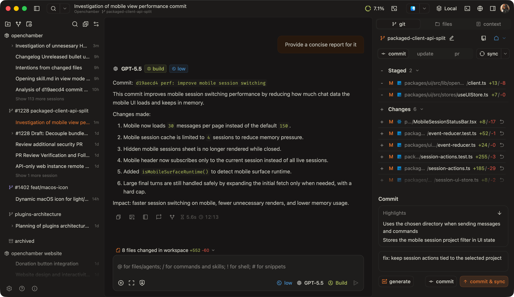
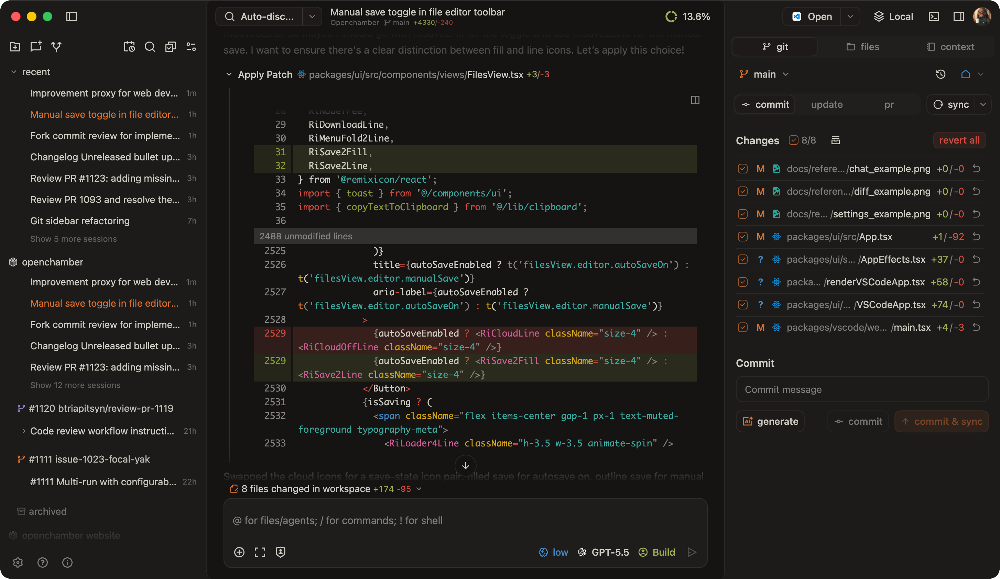
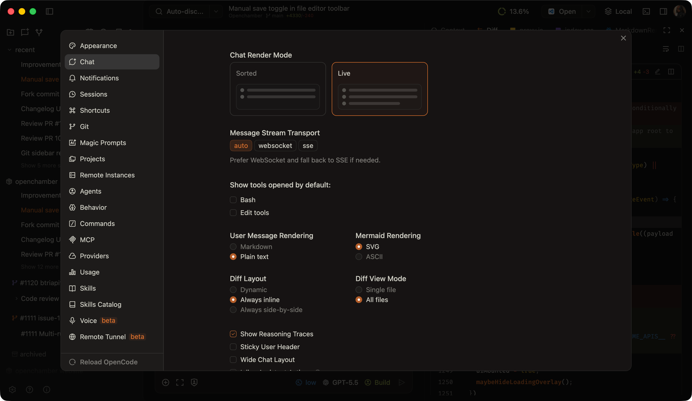
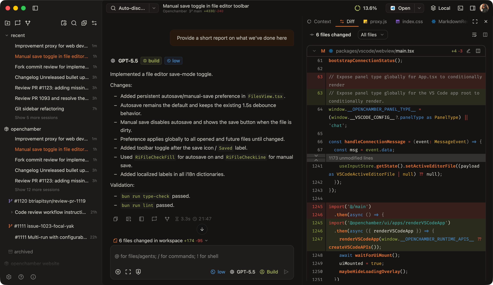
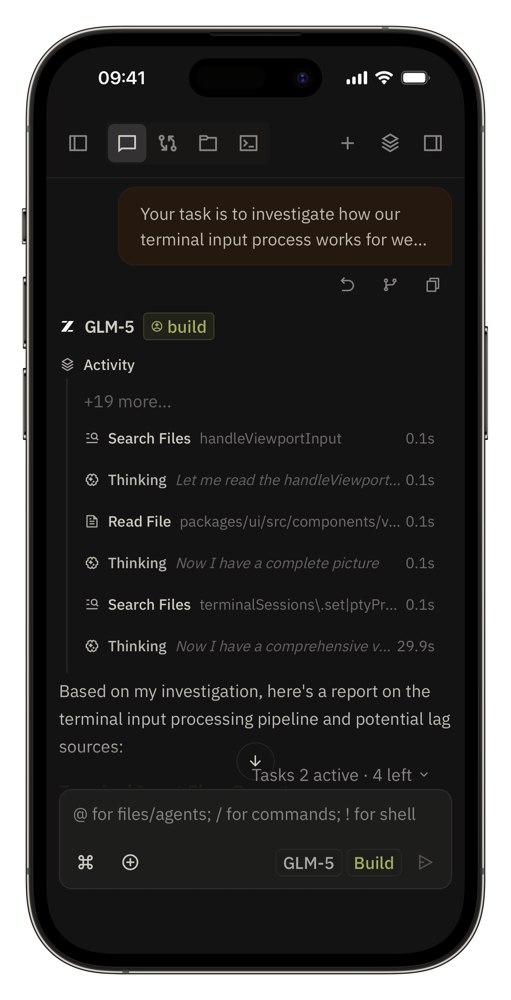

# OpenJunior

[![GitHub stars](https://img.shields.io/github/stars/xenoxf/openjunior?style=flat&logo=data%3Aimage%2Fsvg%2Bxml%3Bbase64%2CPHN2ZyB4bWxucz0iaHR0cDovL3d3dy53My5vcmcvMjAwMC9zdmciIHdpZHRoPSIzMiIgaGVpZ2h0PSIzMiIgZmlsbD0iI2YxZWNlYyIgdmlld0JveD0iMCAwIDI1NiAyNTYiPjxwYXRoIGQ9Ik0yMjkuMDYsMTA4Ljc5bC00OC43LDQyLDE0Ljg4LDYyLjc5YTguNCw4LjQsMCwwLDEtMTIuNTIsOS4xN0wxMjgsMTg5LjA5LDczLjI4LDIyMi43NGE4LjQsOC40LDAsMCwxLTEyLjUyLTkuMTdsMTQuODgtNjIuNzktNDguNy00MkE4LjQ2LDguNDYsMCwwLDEsMzEuNzMsOTRMOTUuNjQsODguOGwyNC42Mi01OS42YTguMzYsOC4zNiwwLDAsMSwxNS40OCwwbDI0LjYyLDU5LjZMMjI0LjI3LDk0QTguNDYsOC40NiwwLDAsMSwyMjkuMDYsMTA4Ljc5WiIgb3BhY2l0eT0iMC4yIj48L3BhdGg%2BPHBhdGggZD0iTTIzOS4xOCw5Ny4yNkExNi4zOCwxNi4zOCwwLDAsMCwyMjQuOTIsODZsLTU5LTQuNzZMMTQzLjE0LDI2LjE1YTE2LjM2LDE2LjM2LDAsMCwwLTMwLjI3LDBMOTAuMTEsODEuMjMsMzEuMDgsODZhMTYuNDYsMTYuNDYsMCwwLDAtOS4zNywyOC44Nmw0NSwzOC44M0w1MywyMTEuNzVhMTYuMzgsMTYuMzgsMCwwLDAsMjQuNSwxNy44MkwxMjgsMTk4LjQ5bDUwLjUzLDMxLjA4QTE2LjQsMTYuNCwwLDAsMCwyMDMsMjExLjc1bC0xMy43Ni01OC4wNyw0NS0zOC44M0ExNi40MywxNi40MywwLDAsMCwyMzkuMTgsOTcuMjZabS0xNS4zNCw1LjQ3LTQ4LjcsNDJhOCw4LDAsMCwwLTIuNTYsNy45MWwxNC44OCw2Mi44YS4zNy4zNywwLDAsMS0uMTcuNDhjLS4xOC4xNC0uMjMuMTEtLjM4LDBsLTU0LjcyLTMzLjY1YTgsOCwwLDAsMC04LjM4LDBMNjkuMDksMjE1Ljk0Yy0uMTUuMDktLjE5LjEyLS4zOCwwYS4zNy4zNywwLDAsMS0uMTctLjQ4bDE0Ljg4LTYyLjhhOCw4LDAsMCwwLTIuNTYtNy45MWwtNDguNy00MmMtLjEyLS4xLS4yMy0uMTktLjEzLS41cy4xOC0uMjcuMzMtLjI5bDYzLjkyLTUuMTZBOCw4LDAsMCwwLDEwMyw5MS44NmwyNC42Mi01OS42MWMuMDgtLjE3LjExLS4yNS4zNS0uMjVzLjI3LjA4LjM1LjI1TDE1Myw5MS44NmE4LDgsMCwwLDAsNi43NSw0LjkybDYzLjkyLDUuMTZjLjE1LDAsLjI0LDAsLjMzLjI5UzIyNCwxMDIuNjMsMjIzLjg0LDEwMi43M1oiPjwvcGF0aD48L3N2Zz4%3D&logoColor=FFFCF0&labelColor=100F0F&color=66800B)](https://github.com/xenoxf/openjunior/stargazers)
[](https://github.com/xenoxf/openjunior/releases/latest)
[](https://opencode.ai)
[](https://discord.gg/ZYRSdnwwKA)
[](https://ko-fi.com/G2G41SAWNS)

> **OpenJunior nace como un fork de OpenChamber** con una visión distinta: llevar la experiencia de los agentes de código al usuario común, no solo al dev que ya vive en terminal. Mejoras de UX, catálogo de MCPs, Skills reutilizables e integraciones con el ecosistema Google.  
> _Y esto es solo el principio. Seremos mejores que Anthropic._

## **Un agente de código que cualquiera puede usar.** Desktop. Web. Móvil.

OpenJunior es una interfaz rica para agentes de código AI. Review diffs, gestiona agentes, corre servidores y mantén el panorama completo mientras tu AI codea. Desde el navegador, el escritorio o tu celular.



<details>
<summary>Más capturas</summary>





<p>


</p>

</details>

## ¿Por qué OpenJunior?

- **Multi-dispositivo**: empieza en desktop, continúa en tablet, vuelve al terminal — misma sesión
- **Acceso remoto**: usa agentes de código desde cualquier lugar via navegador
- **Interfaz visual**: una alternativa para quienes prefieren GUI sobre terminal
- **Catálogo de MCPs**: herramientas y APIs listas para tus agentes
- **Skills reutilizables**: automatizaciones que compartes y reusas entre proyectos
- **Integraciones Google**: conecta tu ecosistema Google sin fricción

## Features

### Core

- Línea de tiempo de chat ramificable con `/undo`, `/redo` y forks con un clic desde cualquier turno
- Tool UIs inteligentes para diffs, operaciones de archivo, permisos y progreso de tareas largas
- Modo voz con entrada por speech y respuestas en voz alta para workflows hands-free
- Ejecuciones multi-agente desde un solo prompt con worktrees aislados
- Git workflows en-app: identidades, commits, PRs, checks y merge actions
- Workflows nativos de GitHub: inicia sesiones desde issues y PRs con contexto incluido
- Modo Plan/Build con vista de plan dedicada para diseñar pasos de implementación
- Comentarios inline en diffs, archivos y planes que se envían de vuelta al agente
- Herramientas de visibilidad de contexto (token/cost breakdown, inspección raw de mensajes, resúmenes de actividad)
- Terminal integrada con sesiones por directorio y rendimiento estable en output pesado
- Catálogo de skills built-in y gestión local de skills para automatización reusable
- **MCP Registry**: catálogo completo de MCPs con built-in MCPs, buscador y proxy
- **Integraciones UI renovadas**: pantalla completa, onboarding, conexión con servicios externos
- **Sistema de Skills**: crea, instala y comparte skills desde el catálogo

### Web / PWA

- Túneles Cloudflare con modos `quick`, `managed-remote` y `managed-local`
- Onboarding con un scan: QR + password URL helpers
- Experiencia mobile-first: controles de chat optimizados, layouts keyboard-safe
- Notificaciones en background y actividad de sesión cross-tab confiable
- Auto-update + restart que mantiene la configuración del servidor intacta
- Instalable como PWA con nombre basado en el proyecto

### Desktop (macOS + Windows)

- Floating Mini Chat: asistente pequeño siempre al frente junto a tu editor, browser o terminal
- Múltiples ventanas nativas para proyectos o sesiones separadas
- Notificaciones nativas para alertas de tareas mientras OpenJunior está oculto
- Apertura con un clic en VS Code, Cursor, Terminal, Finder, Explorer y más
- Host switcher para instancias locales y remotas
- Gestión de túneles sin configuración manual
- Conexiones deep-link para unirte a OpenJunior remoto desde un link
- Acceso remoto SSH con importación de hosts, gestión de conexiones y port forwarding

### Personalización

- 18+ temas built-in con variantes claro/oscuro
- Temas personalizados via JSON en `~/.config/openjunior/themes/` — hot reload, sin reinicio
- Atajos de teclado configurables para chat, paneles y servicios
- Controles de fuente, spacing, corner radius y layout
- Iconos de proyecto personalizables con upload y descubrimiento automático de favicon

## Instalación

### Desde la web

Visita **[openjunior.vercel.app](https://openjunior.vercel.app)** y descarga la versión para tu sistema operativo.

### CLI (Web + PWA)
_Requiere Node.js 22+_

```bash
curl -fsSL https://raw.githubusercontent.com/xenoxf/openjunior/main/scripts/install.sh | bash
openjunior --ui-password tu-contraseña
```

<details>
<summary>Opciones avanzadas de CLI</summary>

```bash
openjunior --port 8080                    # Puerto personalizado
openjunior --lan --port 3000              # Escuchar en LAN (0.0.0.0)
openjunior --ui-password secret           # UI protegida con contraseña
openjunior startup enable                 # Iniciar al login como servicio
openjunior tunnel help                    # Comandos de túneles
openjunior tunnel providers               # Proveedores disponibles
openjunior tunnel start --provider cloudflare --mode quick --qr
openjunior connect-url --port 3000        # Agregar servidor a Desktop
openjunior connect-url --server http://host:3000 --qr
openjunior logs                           # Ver logs de la instancia
OPENCODE_PORT=4096 OPENCODE_SKIP_START=true openjunior
openjunior stop                           # Detener servidor
openjunior update                         # Actualizar a última versión
```

</details>

### Desktop (macOS + Windows)
Descarga desde [Releases](https://github.com/xenoxf/openjunior/releases).

<details>
<summary>systemd service (VPN / LAN)</summary>

```bash
# ~/.config/systemd/user/opencode.service
[Unit]
Description=OpenCode Server
[Service]
Type=simple
ExecStart=opencode serve --port 4095
Restart=on-failure
RestartSec=5
[Install]
WantedBy=default.target
```

```bash
# ~/.config/systemd/user/openjunior.service
[Unit]
Description=OpenJunior Web Server
After=opencode.service
[Service]
Type=simple
ExecStart=openjunior serve --port 3000 --host 0.0.0.0 --ui-password tu-password --foreground
Environment="OPENCODE_HOST=http://localhost:4095"
Environment="OPENCODE_SKIP_START=true"
Restart=on-failure
RestartSec=5
[Install]
WantedBy=default.target
```

```bash
systemctl --user daemon-reload
systemctl --user enable --now opencode openjunior
```

</details>

<details>
<summary>Docker</summary>

```bash
docker compose up -d
```

Disponible en `http://localhost:3000`.

Variables de entorno:

| Variable | Descripción |
|---|---|
| `UI_PASSWORD` | Contraseña para la UI |
| `OPENJUNIOR_TUNNEL_MODE` | `quick`, `managed-remote` o `managed-local` |
| `OPENJUNIOR_TUNNEL_PROVIDER` | `cloudflare` |

</details>

## Roadmap

- [ ] Desacoplar OpenJunior de OpenCode — soporte multi-proveedor (Anthropic, OpenAI, Gemini, modelos locales)
- [ ] App móvil nativa (iOS + Android)
- [ ] Más opciones de túneles built-in
- [ ] Tablero Kanban para gestión multi-agente
- [ ] Integración con Linear y más servicios
- [ ] Navegador built-in para preview de apps en desarrollo
- [ ] Linux desktop app nativa
- [ ] Catálogo de plugins/tools personalizados para OpenCode

## Sobre el creador

OpenJunior es mantenido por **Jesús Adrian Camacho Casierra** (aka [xenoxf](https://github.com/xenoxf)), un desarrollador fullstack colombiano de 15 años. Empezó a programar hace 2 años y desde entonces ha construido plataformas educativas con IA (LearnYos), APIs en NestJS y Spring Boot, dashboards desktop con Tauri, y este fork que busca democratizar el acceso a agentes de código.

> _"No me duele hacer cosas para conseguir mis metas."_

## Licencia

MIT
